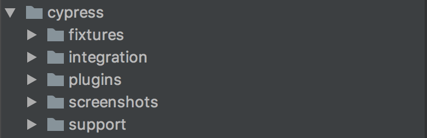
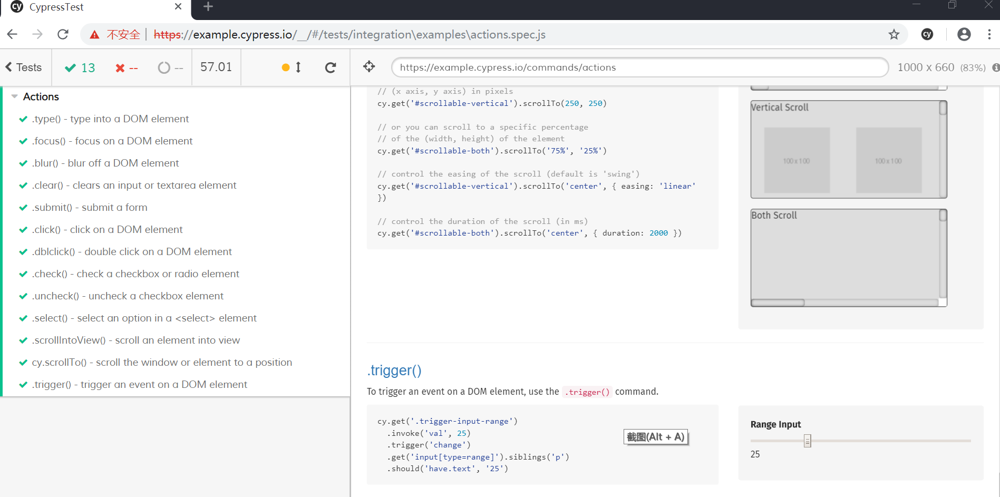
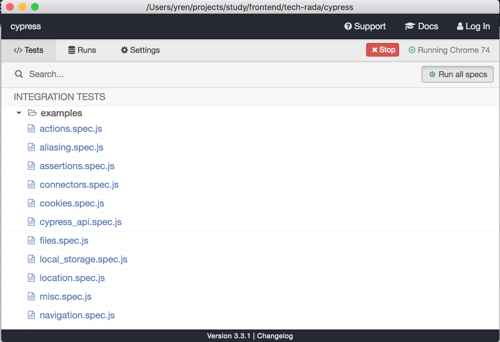
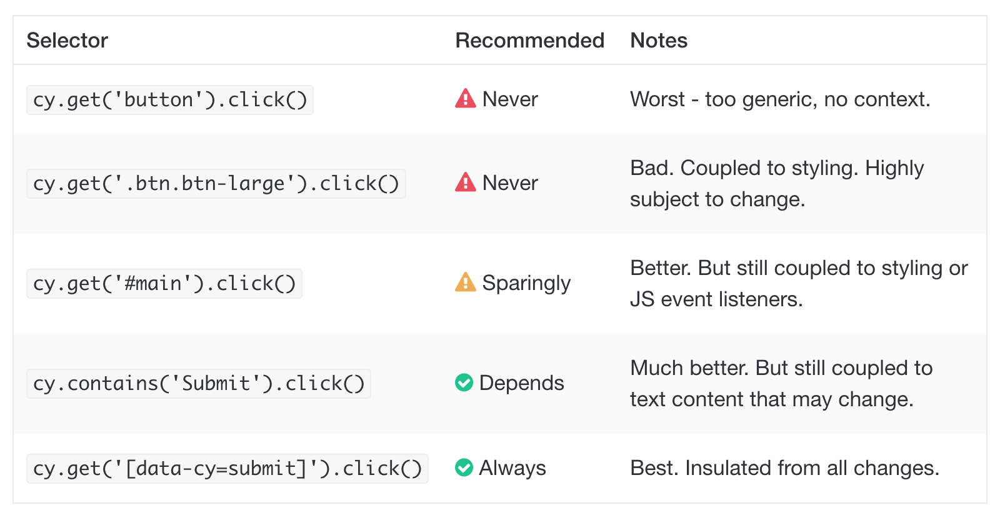

# Cypress

## 上手教程
* 使用cypress，需要安装nodejs。使用npm或yarn安装都行。这里使用npm安装。

```
cd /your/project/path
npm install cypress --save-dev
```
如果是新建的工程，你需要先运行
```
npm init
```
* 运行cypress

安装完成后，有一个cypress目录和cypress.json的配置文件，cypress目录下的结构如下：

cypress.json的配置可以[参考官网](https://docs.cypress.io/guides/references/configuration.html#Folders-Files)。

fixtures 文件夹存放自定义 json 文件，integration文件夹编写测试，plugins 和 support 是非必须使用的文件夹，需要自定义指令的时候会用到。
使用npx执行cypress

```
npx cypress open
```

启动Cypress，cypress已经为我们准备了丰富的例子。可以点击examples里的任意一个js文件，它会单独打开一个浏览器并开始执行。下图是运行example里的actions.spec.js的效果。


* 切换浏览器

官网上提到cypress可以找到本机上所有兼容的浏览器。因此可以切换浏览器来执行。



* 自定义一个测试用例

测试的接口借鉴mocha，例如describe()，context()，it()，beforeEach()。
```
describe('My First Test', function() {
  beforeEach(function () {
    cy.visit('https://www.amazon.com/')
  })


  it('should login failed with error account', function () {
    cy.get('#nav-your-amazon').click()
    cy.get('#ap_email').type('hhhh@gmail.com')
    cy.get('#ap_password').type('1234')
    cy.get('#signInSubmit').click()
    cy.get('#auth-error-message-box').should('be.visible')
  })
});
```

更多的与页面元素的交互，这里就不赘述，可以参考官网。

测试断言语法类似这样
```
cy.get(':checkbox').should('be.disabled')

cy.get('form').should('have.class', 'form-horizontal')

cy.get('input').should('not.have.value', 'US')
```
## cypress持续集成
官网有一些持续集成的用例可[参考](https://docs.cypress.io/guides/guides/continuous-integration.html#Boot-your-server)

## cypress有哪些最佳实践

* 测试登录状态的管理
反模式：界面交互方式登陆，并且没有存储登陆状态
最佳实践： 代码的方式登陆（post login api），并管理登陆状态。
[参考视频](https://www.youtube.com/watch?v=5XQOK0v_YRE)
* 访问页面元素方式
反模式：易变的selector访问元素
最佳实践：使用data-*属性。
```
<button id="main" class="btn btn-large" data-cy="submit">Submit</button>
```

* 返回值赋值
反模式：给cy的返回值赋予临时变量（const, let...）。
最佳实践：链式调用执行。
```
// DONT DO THIS. IT DOES NOT WORK
// THE WAY YOU THINK IT DOES.

const button = cy.get('button')

const form = cy.get('form')

// nope, fails
button.click()
```
* 访问外部网站
反模式：尝试访问不受控制的网站
最佳实践： 测试你能控制的网站

* 测试之间的依赖
反模式：测试不能独立执行。
最佳实践：测试单独执行。

* 使用after hooks
反模式：使用after hooks清理状态
最佳实践：在测试用例执行前清理状态

* 服务的启动
反模式：在cypress脚本里通过cy.exec()或其他命令启动服务。
最佳实践： 在运行cypress执行器之前启动服务。

* 设置baseUrl
反模式：在cy.visit()中使用baseUrl。
最佳实践：在cypress.json中设置baseUrl。

## 喜欢cypress的理由，总的来说，走心，各种细节的走心：

* 文档友好。文档多处穿插小视频，上手容易。
* 安装的cypress包里面有example可以直接运行，里面有各种浏览器交互接口。
* cypress不依赖于selenium。cypress开箱即用，无需运行环境准备。
* cypress是基于javascript，几乎每个web开发人员都能驾驭（有些测试想要驾驭也是可以的）。
* 与我们已经实验过的Selenium的端到端工具相比，cypress的运行速度要快得多。每次修改会自动触发测试重新执行。测试的执行器对于测试的执行过程的可视化做的很好，便于debug。
* cypress 的持续集成。官方文档上有各种CI环境的集成demo供参考。


